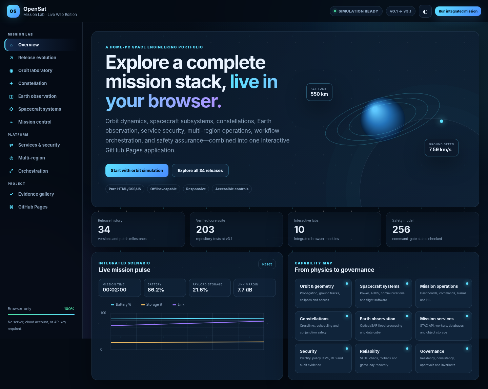

# OpenSat Mission Lab — Live GitHub Pages Edition

A static, interactive space-engineering portfolio covering OpenSat Mission Lab releases v0.1 through v3.1.



## Included interactive modules

- orbit and ground-track laboratory;
- constellation and coordinated tasking;
- synthetic Earth-observation flood processing;
- spacecraft subsystem simulation;
- mission control and fault injection;
- API, security, policy, audit, and SLO simulation;
- active-active multi-region routing;
- signed workflow approval and command safety;
- 34-release evolution explorer and evidence gallery.

## Local preview

```bash
python -m http.server 8786
```

Open `http://127.0.0.1:8786/`.

## Deploy

Push this folder to a GitHub repository. Open **Settings → Pages** and select **GitHub Actions**. The included workflow validates and deploys the site.

The site requires no build command, server application, database, cloud account, or API key.

## Boundary

The browser simulations are simplified educational models. They do not replace the detailed Python engineering project, certified astrodynamics, production security controls, or real spacecraft command systems.
