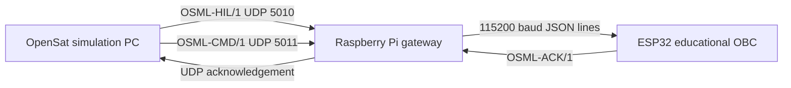

# v1.2 Home-Lab Hardware Integration

OpenSat v1.2 extends software-only UDP loopback into a reproducible physical-lab
path. The Python simulation can stream telemetry to USB/UART, issue commands,
validate acknowledgements, and log captures. A Raspberry Pi can act as a network
to serial gateway, while the ESP32 example provides a visible low-cost endpoint.

## Architecture

## Verification boundary

The automated `hil-hardware-self-test` validates protocol encoding, CRC checks,
command correlation, acknowledgement decoding, and localhost transport. A real
ESP32 run additionally demonstrates operating-system serial drivers, USB/UART
framing, firmware parsing, and device response. Neither test establishes hard
real-time performance, EMC compatibility, radiation tolerance, or flight safety.
